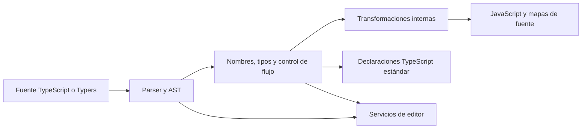

# Arquitectura de Typers

El diseño inicial se conserva como contexto. [ADR 0004](decisions/0004-experimental-runtime-and-if-let.md) concreta el runtime, la activación y el AST normalizado del primer prototipo; [estado](status.md) y [primeros pasos](getting-started.md) identifican la implementación efectiva. Las alternativas restantes no se consideran implementadas por aparecer aquí.

[Índice de documentación](README.md) · [Compatibilidad](compatibility.md) · [Adaptadores](adapters.md) · [Desarrollo con agentes](ai-development.md)

## 1. Estado y alcance de este documento

Este documento recoge la dirección técnica acordada y las decisiones que todavía necesitan un prototipo. No describe un compilador extendido ya terminado.

Se utilizan cuatro estados:

- **Confirmado:** comprobado en el repositorio base o mediante una fuente primaria identificada.
- **Aceptado:** dirección acordada para Typers, pendiente de implementar y verificar cuando corresponda.
- **Propuesto:** diseño recomendado que debe validarse antes de convertirlo en contrato público.
- **Abierto:** cuestión que puede cambiar la implementación y todavía no está resuelta.

La base inicial es TypeScript `v7.0.2`, commit `1e4744d68260a7cb91b62b12edc3f6a2187faaf1`. Cada afirmación de compatibilidad debe indicar esta base o la que la sustituya.

## 2. Producto que queremos construir

**Aceptado:** Typers será un fork de TypeScript que incorpora pocas extensiones inspiradas en Rust y produce JavaScript directamente. El stack de aplicación de referencia sigue siendo TypeScript/NestJS dentro de los proyectos zhenix-ai. El lenguaje en que está escrito el compilador y el lenguaje de las aplicaciones son decisiones diferentes.

Las extensiones buscan expresar resultados esperados, ausencia, selección de variantes y propagación de errores con menos ambigüedad. No se ha decidido reproducir Rust completo, su sistema de memoria, su modelo de concurrencia ni sus garantías de seguridad.

Principios de diseño:

1. Mantener el comportamiento del TypeScript base para código que no activa extensiones.
2. Reutilizar el comprobador de tipos, la resolución de módulos y el generador de código existentes cuando sea posible.
3. Introducir una extensión completa y pequeña antes de ampliar su gramática.
4. Hacer explícitos los costes y los límites de cada funcionalidad.
5. Permitir consumir bibliotecas de Typers como JavaScript y declaraciones TypeScript estándar.
6. Mantener los cambios respecto a upstream localizados y revisables.
7. Evitar varias formas equivalentes de expresar la misma operación en la primera versión.

El objetivo de sustitución del compilador no implica que todas las herramientas que importan paquetes llamados `typescript` funcionen automáticamente. Esa distinción condiciona la arquitectura y se detalla en [Compatibilidad](compatibility.md).

## 3. Mapa de la base real

**Confirmado en el commit base:** el repositorio contiene tanto el árbol histórico del compilador escrito en TypeScript como el compilador nativo integrado bajo `tsc/`.

| Ruta | Papel en esta base | Consecuencia para Typers |
| --- | --- | --- |
| `package.json` de la raíz | Conserva versión `6.0.0` y configuración del árbol histórico. | No usarlo como prueba de la versión del compilador nativo ni renombrarlo como único paso de empaquetado. |
| `src/` | Implementación histórica escrita en TypeScript. | Puede servir como referencia, pruebas y comparación; no es el destino automático de las extensiones de 7.0.2. |
| `tsc/go.mod` | Módulo Go del compilador nativo; declara Go 1.26. | Las modificaciones del compilador se desarrollan y prueban con su toolchain. |
| `tsc/internal/core/version.go` | Declara versión `7.0.2`. | Punto de referencia para verificar el binario base. |
| `tsc/internal/parser/` | Análisis sintáctico. | Lugar a estudiar para la gramática nueva. |
| `tsc/internal/ast/` | Representación de los nodos. | Aquí comienza el impacto de una clase de nodo nueva. |
| `tsc/internal/binder/` y `tsc/internal/checker/` | Enlace de nombres y comprobación de tipos. | Ámbitos, inferencia y control de flujo de las extensiones. |
| `tsc/internal/transformers/` y `tsc/internal/printer/` | Transformaciones y emisión. | Conversión a construcciones JavaScript, mapas de fuente y comentarios. |
| `tsc/_packages/native-preview/` | Fuentes de empaquetado y API JavaScript del compilador nativo. | Punto de partida que debe inspeccionarse, no un paquete Typers listo para publicar. |
| `tsc/_extension/` | Integración de editor heredada del proyecto nativo. | Referencia para el soporte del lenguaje y su distribución. |
| `tsc/_submodules/TypeScript` | Gitlink utilizado por infraestructura del árbol nativo. | Las pruebas y la generación pueden necesitar contenido adicional. |

El paquete de fuentes `native-preview` conserva metadatos y nombres de su etapa anterior; algunos archivos de documentación heredados también conservan instrucciones históricas. El estado ejecutable se obtiene leyendo el código y los scripts del commit concreto. Fuentes: [versión nativa](https://github.com/microsoft/TypeScript/blob/1e4744d68260a7cb91b62b12edc3f6a2187faaf1/tsc/internal/core/version.go), [módulo Go](https://github.com/microsoft/TypeScript/blob/1e4744d68260a7cb91b62b12edc3f6a2187faaf1/tsc/go.mod), [paquete nativo](https://github.com/microsoft/TypeScript/blob/1e4744d68260a7cb91b62b12edc3f6a2187faaf1/tsc/_packages/native-preview/package.json).

La ubicación de `.gitmodules` dentro de `tsc/` debe tenerse en cuenta al preparar las pruebas. No se debe asumir que ejecutar indiscriminadamente un comando de submódulos desde la raíz resolverá la disposición importada. La preparación de dependencias de pruebas debe quedar automatizada y documentada cuando se valide por primera vez. [Configuración heredada del submódulo](https://github.com/microsoft/TypeScript/blob/1e4744d68260a7cb91b62b12edc3f6a2187faaf1/tsc/.gitmodules).

## 4. Componentes y responsabilidades

La siguiente división es una **propuesta de organización**, no una declaración de paquetes publicados.

| Componente | Responsabilidad | Dependencia en una aplicación |
| --- | --- | --- |
| Compilador Typers | Leer TypeScript y las extensiones habilitadas, comprobar tipos y emitir JS/`.d.ts`/mapas. | Normalmente desarrollo y construcción. |
| Runtime Typers | Representar `Result` y `Option`, constructores y operaciones mínimas. | Ejecución, cuando el código utiliza valores o funciones del runtime. |
| Integraciones | CLI, editor, NestJS, linter, formateador y otros consumidores del compilador. | Desarrollo; algunas integraciones del framework pueden tener una parte de ejecución. |
| Generador de adaptadores | Producir envoltorios revisables para bibliotecas seleccionadas. | Desarrollo; el envoltorio generado puede ser una dependencia de ejecución. |
| Pruebas de compatibilidad | Comparación con upstream y aplicaciones representativas. | Infraestructura de desarrollo de Typers. |

**Aceptado:** separar el runtime del compilador. Dos artefactos con responsabilidades distintas no significan ejecutar dos compiladores. Una aplicación desplegada no debería necesitar el binario del compilador para construir `Ok(value)`.

**Abierto:** nombres definitivos en npm, scopes, plataformas iniciales de binarios y política ESM/CommonJS. No se debe presentar `npm install typers` como una instrucción funcional hasta que el nombre, el paquete y su publicación estén verificados. Los ejemplos que usen nombres futuros deben etiquetarse como propuestas.

No inyectaremos `Result`, `Option`, `Some` ni `Ok` como variables globales por defecto. Una importación explícita permite localizar la dependencia y reduce colisiones con bibliotecas existentes. La semántica precisa de reconocimiento de constructores por el compilador sigue abierta.

## 5. Pipeline de compilación

**Aceptado:** la salida pública del compilador es JavaScript. No se requiere un archivo TypeScript intermedio ni una segunda invocación de otro compilador para las aplicaciones.



La transformación interna de una construcción nueva en nodos equivalentes existentes es compatible con ese objetivo. Es una fase del compilador, como las transformaciones que ya necesita JavaScript según el target. No implica distribuir ni compilar primero un archivo `.ts` generado.

Hay dos enfoques internos que deben compararse con el primer prototipo:

| Enfoque | Ventaja | Coste o límite |
| --- | --- | --- |
| Nodo propio que atraviesa las fases necesarias. | Conserva la intención sintáctica para diagnósticos, editor y herramientas conscientes de Typers. | Obliga a actualizar visitantes, serialización de AST, generación y fases semánticas pertinentes. |
| Normalización temprana a nodos existentes con información del origen. | Puede reutilizar parte del análisis semántico del compilador. | Mantener ubicaciones, comentarios, inferencia, identidad y depuración puede resultar difícil. |

**Propuesto:** decidir después de un prototipo medido de `if let`, manteniendo una representación del origen suficiente para el editor. No declarar resuelta la arquitectura mediante un reemplazo textual. Un reemplazo con expresiones regulares no conoce ámbitos, comentarios, plantillas, JSX ni prioridades de operadores.

## 6. Modo TypeScript y modo con extensiones

**Aceptado:** la mera presencia del compilador Typers no debe cambiar el significado de código TypeScript estándar. Las extensiones necesitan una forma identificable de activación y una política de evolución.

**Abierto:** mecanismo exacto de activación. Alternativas que deben evaluarse:

- Una opción de compilación propia que permita extensiones en `.ts` y `.tsx`.
- Una extensión de archivo específica, que también obliga a adaptar resolución de módulos, editor y herramientas.
- Una combinación de configuración por proyecto y soporte explícito en integraciones.

Para la primera experiencia controlada puede utilizarse una opción experimental del compilador. El nombre y la sintaxis de configuración deben especificarse antes de introducir el parser. No se ha decidido que los usuarios tengan que renombrar todos sus archivos.

Invariantes de activación:

1. Un proyecto sin extensiones conserva la sintaxis y la semántica de su versión upstream.
2. Una extensión desactivada produce un diagnóstico claro; no se interpreta parcialmente.
3. Los nombres nuevos no se convierten sin necesidad en palabras reservadas globales.
4. Las declaraciones destinadas a consumidores TypeScript no incluyen sintaxis privada.
5. El modo experimental se refleja en la identidad de las cachés y resultados incrementales.
6. La presencia de una extensión en una dependencia no debe activar funciones de lenguaje de forma silenciosa en todo el proyecto.

Añadir sintaxis solo en secuencias actualmente inválidas reduce colisiones, pero no demuestra ausencia de cambios de parser. Deben probarse recuperación de errores, formato automático y programas parcialmente escritos.

## 7. Contrato del runtime

**Aceptado:** el primer núcleo contiene `Result<T, E>`, `Ok`, `Err`, `Option<T>`, `Some` y `None`. Se implementa con TypeScript estándar y se puede utilizar antes de añadir nueva gramática.

**Propuesto:** uniones discriminadas con campos de solo lectura y representaciones simples. La elección exacta del discriminante, nombres de campos y forma de `None` pertenece a la especificación del runtime y debe quedar fijada antes de depender de ella desde el compilador.

Ejemplo conceptual de representación, todavía sujeto al contrato definitivo:

```ts
type Result<T, E> =
  | { readonly kind: "ok"; readonly value: T }
  | { readonly kind: "err"; readonly error: E };

type Option<T> =
  | { readonly kind: "some"; readonly value: T }
  | { readonly kind: "none" };
```

Consecuencias que deben documentarse:

- `readonly` limita asignaciones comprobadas por TypeScript; no congela automáticamente objetos en JavaScript.
- `None` representa ausencia explícita. `Some(0)`, `Some(false)`, `Some("")` y, si el contrato lo permite, `Some(undefined)`, siguen siendo presencia.
- `Err` es un valor de resultado, no una excepción lanzada por el constructor.
- `Result<T, E>` por sí solo no demuestra que la función nunca lance una excepción.
- Una representación estructural facilita interoperabilidad, pero permite valores fabricados con la misma forma. Un tipo nominal o una marca también tiene costes de compatibilidad.
- Ningún tipo TypeScript sustituye la validación de datos recibidos por red o leídos de almacenamiento.
- La serialización JSON debe ser un contrato explícito, especialmente para `undefined`, `Error`, fechas y clases.

Conviene mantener pequeño el primer conjunto de combinadores. Funciones como `map`, `mapErr`, `andThen`, `unwrap`, conversiones de nullabilidad y utilidades asíncronas deben incorporarse cuando exista un caso de uso y se defina su tratamiento de callbacks que lanzan.

## 8. Primera sintaxis: `if let` acotado

**Aceptado como siguiente extensión recomendada, pendiente de implementación:** empezar con un único patrón `Some(nombre)` aplicado a `Option<T>`, un bloque y una rama `else` opcional. No se ha aceptado todavía un sistema completo de patrones.

```text
// Propuesta de sintaxis Typers; no es TypeScript estándar.
if let Some(user) = repository.findById(id) {
    return Ok(user);
} else {
    return Err({ kind: "UserNotFound", id });
}
```

Semántica mínima que debe quedar cubierta por pruebas:

1. Evaluar `repository.findById(id)` exactamente una vez.
2. Distinguir variantes mediante el contrato de `Option`, no mediante la veracidad del valor.
3. Inferir `user` como el contenido de `Some`.
4. Limitar la variable al bloque correspondiente.
5. Conservar el orden de efectos y el comportamiento de `return`, `throw`, `break` y `continue` dentro de los bloques donde sean legales.
6. Generar nombres temporales sin colisiones con identificadores del usuario.
7. Asociar los errores y la depuración al texto original.
8. Preservar comentarios relevantes y emitir JavaScript válido en los targets admitidos.

No basta con reconocer que una llamada se escribe `Some`. Debe definirse qué sucede con alias de importación, un identificador local del mismo nombre, dos versiones del runtime y valores construidos estructuralmente. La primera versión puede rechazar formas no soportadas con un diagnóstico específico.

El prototipo no debe ampliar de forma accidental el alcance a patrones anidados, guardas, patrones de objeto, `Ok`/`Err`, exhaustividad ni protocolos de patrones de usuario. Esas funciones requieren su propia decisión.

## 9. Propagación y control de flujo posteriores

El operador `?` es un candidato valioso, pero su semántica atraviesa más fases que su representación visual sugiere. Antes de implementarlo se deben resolver:

- Qué tipos puede propagar: inicialmente `Result`, `Option` o ambos.
- Cómo comprobar que el retorno de la función envolvente acepta la variante propagada.
- Si los errores se convierten de forma implícita; la propuesta inicial es evitarlas.
- Cómo actúa en funciones asíncronas y en qué orden se combina con `await`.
- Qué sucede en lambdas, generadores, inicializadores y funciones que no devuelven el tipo esperado.
- Prioridad y ambigüedad frente a condicionales, miembros opcionales y sintaxis existente.
- Qué ocurre dentro de `try`, `catch` y `finally`, incluido un `finally` que altera el retorno.
- Cómo conservar la evaluación y el orden de efectos en argumentos, cortocircuitos y expresiones anidadas.

Una transformación mediante una función auxiliar o una IIFE no reproduce automáticamente un retorno desde la función envolvente. Un `throw` interno utilizado como mecanismo de propagación tampoco es equivalente: puede ser interceptado por un `catch` existente y cambia la observabilidad del programa.

`let-else`, `while let` y `match` se incorporarán después de especificar ámbitos y patrones. La exhaustividad de un `match` requiere razonar sobre el conjunto de variantes, guardas y tipos abiertos; no se reduce a transformar la expresión en un `switch`.

## 10. Distribución y fronteras públicas

Una biblioteca escrita con Typers debería poder publicar:

```text
fuentes Typers
    -> JavaScript distribuible
    -> declaraciones .d.ts de TypeScript estándar
    -> mapas de fuente cuando corresponda
```

Un consumidor que solo ejecuta ese JavaScript no necesita analizar la sintaxis Typers. Un consumidor que compila directamente las fuentes sí necesita un parser que la conozca. Los campos `exports`, las condiciones de módulos y los mapas de tipos deben dejar clara esta frontera.

El paquete compilador necesita probar el artefacto instalado, además de su directorio fuente. Deben verificarse CLI, permisos del binario, selección de plataforma, rutas relativas de bibliotecas estándar y ejecución desde un directorio ajeno al repositorio. Una prueba que solo funciona mediante enlaces locales puede ocultar archivos omitidos del paquete.

**Propuesto:** metadatos separados para la versión Typers y la base upstream. No fingir que una revisión modificada es una distribución original de Microsoft. El versionado concreto se documentará junto con el proceso de releases; una misma base de TypeScript puede necesitar varias correcciones de Typers.

## 11. Observabilidad y rendimiento

Los criterios de arquitectura incluyen compilación fría, compilación incremental, memoria, tamaño de artefactos, arranque de la aplicación y calidad de diagnósticos. El número de líneas nuevas del parser no es una medida suficiente de simplicidad.

Toda extensión debe incluir:

- Al menos un ejemplo de salida JavaScript revisado.
- Explicación de asignaciones u objetos adicionales que produzca.
- Pruebas con efectos secundarios y casos de error de tipos.
- Pruebas de mapas de fuente si introduce temporales o reorganiza expresiones.
- Identificación de las fases que requieren mantenimiento al actualizar upstream.

No se ha acordado prometer coste cero. `Result` y `Option` pueden implicar objetos, llamadas y decisiones de ejecución dependiendo de la representación. Las comparaciones deben medir código equivalente bajo la misma versión de Node y configuración.

## 12. Decisiones que desbloquean el desarrollo

Antes de declarar estable la primera sintaxis se deben cerrar, mediante una decisión escrita y pruebas, estas cuestiones:

| Decisión | Motivo |
| --- | --- |
| Contrato exacto y versión del runtime | El código emitido y la identificación de variantes dependen de él. |
| Activación de extensiones y extensiones de archivo | Define qué herramientas necesitan comprender la nueva gramática. |
| Reconocimiento de `Some` y alias | Evita cambiar el significado de nombres ordinarios del usuario. |
| Representación del AST | Determina diagnósticos, servicios de editor y compatibilidad con consumidores. |
| Estrategia para la API histórica del compilador | Bloquea la sustitución transparente en herramientas como determinadas versiones de Nest CLI. |
| Soporte de Oxlint/Oxfmt | Condiciona el flujo de trabajo zhenix-ai con sintaxis propia. |
| Política de publicación y binarios | Determina si la instalación funciona fuera de la máquina de desarrollo. |

La hoja de ruta debe usar estos puntos como puertas de aceptación. Las incógnitas de API o del editor no deben ocultarse detrás de una demostración donde únicamente se ejecuta un archivo JavaScript.
